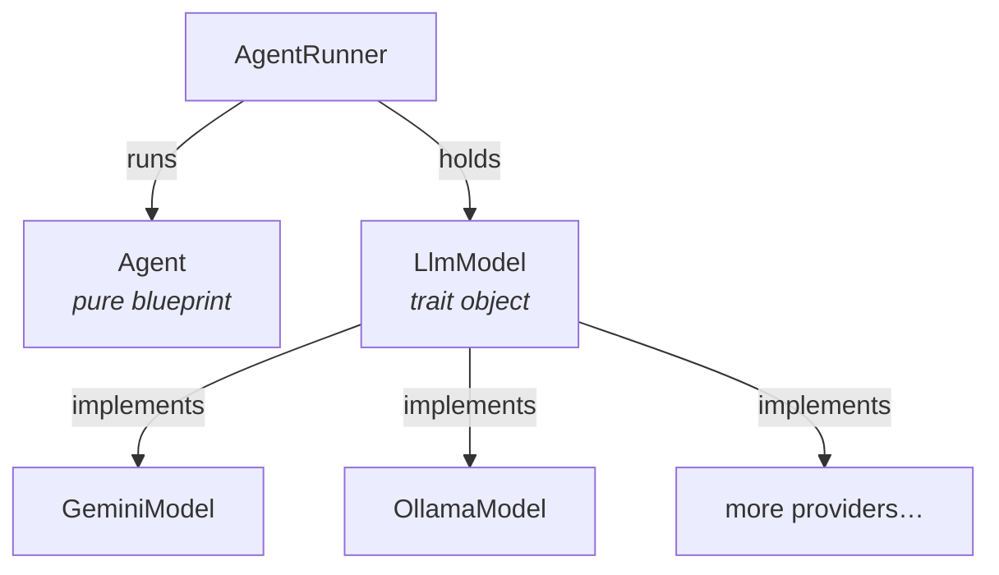

# rust-agent-kit

A provider-agnostic toolkit for building AI agents in Rust.

Define your agent once and run it against any supported LLM backend — swap providers by changing a single constructor call, with no changes to agent logic.

## Features

- **Provider-agnostic API** — same `Agent` + `AgentRunner` code works with Google Gemini, Ollama, or any custom `LlmModel` implementation
- **Agentic loop** — the runner automatically handles tool call / response cycles until the model produces a final text response
- **Concurrent tool execution** — multiple tool calls in a single model turn are executed in parallel
- **Multi-turn conversations** — pass conversation history via `RunBuilder` for stateful dialogue
- **Structured output** — constrain model output to a JSON Schema; `run_typed<T>` deserializes directly into your type
- **Streaming** — token-by-token output via `run_stream`, including thinking tokens from extended-reasoning models
- **Agent composition** — wrap any agent as a `Tool` with `AgentTool` so a parent agent can delegate to child agents
- **Serializable agents** — `Agent` derives `Serialize`/`Deserialize` for file-based configuration
- **Opt-in providers** — each provider adapter is a Cargo feature; pull in only what you need

## Supported Providers

| Feature   | Provider        | Notes                                        |
|-----------|-----------------|----------------------------------------------|
| `gemini`  | Google Gemini   | Structured output, thinking tokens           |
| `ollama`  | Ollama (local)  | Structured output, native streaming          |

## Installation

Add `rust-agent-kit` to your `Cargo.toml`. Provider adapters are opt-in features.

```toml
# Gemini only
rust-agent-kit = { git = "...", features = ["gemini"] }

# Ollama only
rust-agent-kit = { git = "...", features = ["ollama"] }

# All providers
rust-agent-kit = { git = "...", features = ["full"] }
```

## Quick Start

```rust
use rust_agent_kit::{Agent, AgentRunner};
use rust_agent_kit::models::gemini::GeminiModel;

#[tokio::main]
async fn main() -> Result<(), Box<dyn std::error::Error>> {
    let model = GeminiModel::builder("YOUR_API_KEY", "gemini-3.1-flash-lite-preview")
        .temperature(0.8)
        .build();

    let agent = Agent::builder()
        .name("Assistant")
        .instructions("You are a helpful assistant.")
        .build();

    let runner = AgentRunner::new(Box::new(model));
    let result = runner.run(&agent, "Hello!").await?;
    println!("{}", result.output);
    Ok(())
}
```

Set your API key via environment variable (a `.env` file is supported via `dotenvy`):

```bash
GEMINI_API_KEY=your_key cargo run
```

## Usage

### Single-turn

The simplest path: create a runner, run an agent, get text back.

```rust
let result = runner.run(&agent, "What is the capital of France?").await?;
println!("{}", result.output); // "Paris"
```

### Multi-turn conversations

`run_builder` + `history` enables stateful dialogue. The runner is stateless; you own and extend the history.

```rust
use rust_agent_kit::model::Message;

// First turn
let first = runner.run(&agent, "My name is Alice.").await?;

// Build history
let mut history = vec![
    Message::user("My name is Alice."),
    Message::assistant(&first.output),
];

// Second turn — model remembers the name
let second = runner
    .run_builder(&agent)
    .history(history.clone())
    .run("What is my name?")
    .await?;

println!("{}", second.output); // "Your name is Alice."
```

### Tool calling

Implement the `Tool` trait to give the agent callable functions. The runner handles the request/tool/response loop automatically.

```rust
use async_trait::async_trait;
use rust_agent_kit::tool::{Tool, ToolDefinition, ToolRegistry};
use rust_agent_kit::error::Error;
use serde_json::{json, Value};
use std::sync::Arc;

struct GetWeatherTool;

#[async_trait]
impl Tool for GetWeatherTool {
    fn definition(&self) -> ToolDefinition {
        ToolDefinition {
            name: "get_weather".to_string(),
            description: "Returns the current temperature for a city.".to_string(),
            parameters: json!({
                "type": "object",
                "properties": {
                    "city": { "type": "string" }
                },
                "required": ["city"]
            }),
        }
    }

    async fn call(&self, args: Value) -> Result<Value, Error> {
        let city = args["city"].as_str().unwrap_or("unknown");
        Ok(json!({ "city": city, "celsius": 22.0 }))
    }
}

let registry = Arc::new(
    ToolRegistry::new().register(Box::new(GetWeatherTool))
);

let agent = Agent::builder()
    .name("Weather Bot")
    .instructions("Answer weather questions using the available tools.")
    .tool("get_weather")
    .build();

let runner = AgentRunner::with_registry(Box::new(model), registry);
let result = runner.run(&agent, "What is the temperature in Tokyo?").await?;
```

### Structured output

Use `output_schema` to constrain the model to a JSON Schema, then `run_typed<T>` to deserialize directly into your type. The [`schemars`](https://crates.io/crates/schemars) crate can generate the schema from a Rust struct.

```rust
use schemars::JsonSchema;
use serde::{Deserialize, Serialize};

#[derive(Debug, Deserialize, JsonSchema)]
struct ResearchPlan {
    title: String,
    tasks: Vec<String>,
}

let agent = Agent::builder()
    .name("Planner")
    .instructions("Produce a structured research plan.")
    .output_schema(schemars::schema_for!(ResearchPlan))
    .build();

let plan: ResearchPlan = runner.run_typed(&agent, "AI agents").await?;
println!("{}", plan.title);
```

### Streaming

`run_stream` returns an async stream of `AgentEvent` values, including incremental text chunks and thinking tokens from reasoning models.

```rust
use futures_util::StreamExt;
use rust_agent_kit::AgentEvent;

let stream = runner.run_stream(&agent, "Explain Rust ownership.");
futures_util::pin_mut!(stream);

while let Some(event) = stream.next().await {
    match event? {
        AgentEvent::Thinking(token) => print!("[thinking] {token}"),
        AgentEvent::TextDelta(chunk) => print!("{chunk}"),
        AgentEvent::ToolCallStarted { name, .. } => println!("[calling {name}]"),
        AgentEvent::ToolCallCompleted { name, .. } => println!("[{name} done]"),
    }
}
```

### Agent composition

Wrap an `AgentRunner` + `Agent` pair as a `Tool` using `AgentTool`, then register it with a parent runner. The parent model can invoke the child agent as if it were a regular tool.

```rust
use rust_agent_kit::{AgentTool, Agent, AgentRunner};
use rust_agent_kit::tool::{ToolDefinition, ToolRegistry};
use serde_json::json;
use std::sync::Arc;

// Child agent
let child_model = GeminiModel::builder(&api_key, MODEL).build();
let child_agent = Agent::builder()
    .name("Summariser")
    .instructions("Summarise the text in the 'text' field of your JSON input.")
    .build();
let child_runner = AgentRunner::new(Box::new(child_model));

let summarise_tool = AgentTool::new(
    ToolDefinition {
        name: "summarise".to_string(),
        description: "Summarises a long piece of text into two sentences.".to_string(),
        parameters: json!({
            "type": "object",
            "properties": { "text": { "type": "string" } },
            "required": ["text"]
        }),
    },
    child_agent,
    child_runner,
);

// Parent runner
let registry = Arc::new(ToolRegistry::new().register(Box::new(summarise_tool)));
let parent_runner = AgentRunner::with_registry(Box::new(parent_model), registry);

let parent_agent = Agent::builder()
    .name("Orchestrator")
    .instructions("Use the `summarise` tool when asked to summarise text.")
    .tool("summarise")
    .build();

let result = parent_runner.run(&parent_agent, "Summarise: ...").await?;
```

## Provider Configuration

### Google Gemini

Requires a `GEMINI_API_KEY` environment variable.

```rust
use rust_agent_kit::models::gemini::GeminiModel;
use google_genai::prelude::{ThinkingConfig, ThinkingLevel};

let model = GeminiModel::builder("API_KEY", "gemini-3.1-flash-lite-preview")
    .temperature(0.7)
    .max_output_tokens(2048)
    .top_p(0.9)
    .thinking_config(ThinkingConfig {
        include_thoughts: true,
        thinking_level: Some(ThinkingLevel::High),
        ..Default::default()
    })
    .build();
```

### Ollama

Requires a running [Ollama](https://ollama.ai) server (default: `http://localhost:11434`).

```rust
use rust_agent_kit::models::ollama::OllamaModel;

let model = OllamaModel::builder("llama3.2")
    .temperature(0.8)
    .num_ctx(4096)
    .build();
```

## Architecture



`Agent` is a pure data blueprint with no model reference — it holds the name, instructions, optional output schema, and the list of tool names the agent may use. `AgentRunner` owns the `Box<dyn LlmModel>` and is the execution engine. The same runner can execute multiple agents; the same agent can be run by different runners backed by different models.

### Core Types

| Type | Description |
|------|-------------|
| `Agent` / `AgentBuilder` | Serializable agent definition (name, instructions, tools, output schema) |
| `AgentRunner` | Execution engine; owns the model and tool registry |
| `RunBuilder` | Fluent builder for a single run; accepts conversation history |
| `LlmModel` | Async trait that provider adapters implement |
| `Tool` / `ToolDefinition` | Async trait for callable tools; JSON Schema parameters |
| `ToolRegistry` | Shared, thread-safe registry of `Tool` implementations |
| `AgentTool` | Wraps an `AgentRunner` + `Agent` as a `Tool` for agent composition |
| `AgentEvent` | Stream event: `TextDelta`, `Thinking`, `ToolCallStarted`, `ToolCallCompleted` |
| `AgentResult` | Final output from `run` / `run_typed` |
| `Error` | `Provider(String)` or `Agent(String)` |

### Custom providers

Implement `LlmModel` to add any provider:

```rust
use async_trait::async_trait;
use rust_agent_kit::model::{LlmModel, ModelRequest, ModelResponse};
use rust_agent_kit::error::Error;

struct MyModel;

#[async_trait]
impl LlmModel for MyModel {
    async fn generate(&self, request: ModelRequest) -> Result<ModelResponse, Error> {
        // Translate ModelRequest → your provider's API call
        // Return ModelResponse { text, tool_calls, thinking }
        todo!()
    }
}
```

Pass it to the runner: `AgentRunner::new(Box::new(MyModel))`.

## Running Examples

All examples require a Gemini API key (or a running Ollama server for Ollama examples).

```bash
# Simple single-turn agent
GEMINI_API_KEY=your_key cargo run --example simple_agent --features gemini

# Tool calling
GEMINI_API_KEY=your_key cargo run --example tool_calling --features gemini

# Structured output
GEMINI_API_KEY=your_key cargo run --example structured_output --features gemini

# Streaming with thinking tokens
GEMINI_API_KEY=your_key cargo run --example streaming_agent --features gemini

# Multi-turn REPL
GEMINI_API_KEY=your_key cargo run --example multi_turn --features gemini

# Agent as a tool (composition)
GEMINI_API_KEY=your_key cargo run --example agent_as_tool --features gemini
```

## Testing

```bash
# Unit tests (no network)
cargo test

# Gemini integration tests (requires GEMINI_API_KEY)
GEMINI_API_KEY=your_key cargo test --test integration_gemini --features gemini

# Ollama integration tests (requires running Ollama server)
cargo test --test integration_ollama --features ollama
```

## Building

```bash
cargo build                        # default (no providers compiled)
cargo build --features gemini      # with Gemini
cargo build --features full        # all providers
cargo build --release --features full
```

## License

See [LICENSE](LICENSE).
