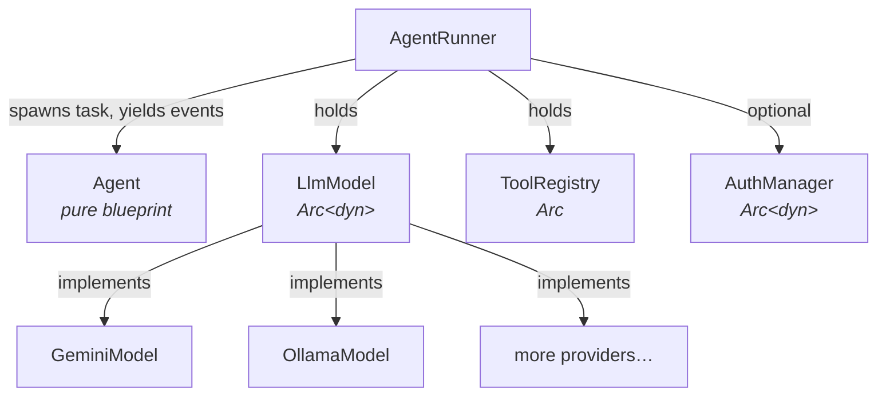

# agent-rig

A provider-agnostic toolkit for building AI agents in Rust.

Define your agent once and run it against any supported LLM backend — swap providers by changing a single constructor call, with no changes to agent logic.

## Features

- **Provider-agnostic API** — same `Agent` + `AgentRunner` code works with Google Gemini, Ollama, or any custom `LlmModel` implementation
- **Streaming agentic loop** — the runner spawns a background task and yields `AgentEvent`s (text deltas, thinking tokens, tool-call lifecycle) until the model produces a final reply
- **Concurrent tool execution** — multiple tool calls in a single model turn are executed in parallel; tool-result messages are paired back to the model in request order
- **Authorization hook** — plug in an `AuthManager` to gate tool calls (e.g. user approval prompts for destructive actions)
- **Structured output** — constrain model output to a JSON Schema
- **Agent composition** — wrap any agent as a `Tool` with `AgentTool` so a parent agent can delegate to child agents
- **Serializable agents** — `Agent` derives `Serialize`/`Deserialize` for file-based configuration
- **Opt-in providers** — each provider adapter is a Cargo feature; pull in only what you need

## Supported Providers

| Feature   | Provider        | Notes                                        |
|-----------|-----------------|----------------------------------------------|
| `gemini`  | Google Gemini   | Structured output, thinking tokens           |
| `ollama`  | Ollama (local)  | Structured output, native streaming          |

## Installation

Add `agent-rig` to your `Cargo.toml`. Provider adapters are opt-in features — the default feature set is empty.

```toml
# Gemini only
agent-rig = { git = "...", features = ["gemini"] }

# Ollama only
agent-rig = { git = "...", features = ["ollama"] }

# All providers
agent-rig = { git = "...", features = ["full"] }
```

## Quick Start

```rust
use std::sync::Arc;
use agent_rig::Agent;
use agent_rig::model::Message;
use agent_rig::models::gemini::GeminiModel;
use agent_rig::runner::{AgentEvent, AgentRunner};
use futures_util::StreamExt;

#[tokio::main]
async fn main() -> Result<(), Box<dyn std::error::Error>> {
    let model = GeminiModel::builder("YOUR_API_KEY", "gemini-3.1-flash-lite")
        .temperature(0.8)
        .build();

    let agent = Agent::builder()
        .name("Assistant")
        .instructions("You are a helpful assistant.")
        .build();

    let runner = AgentRunner::new(Arc::new(model));

    let mut stream = runner.run(&agent, vec![Message::user("Hello!")]);
    while let Some(event) = stream.next().await {
        if let AgentEvent::TextDelta(chunk) = event.agent_event {
            print!("{chunk}");
        }
    }
    println!();
    Ok(())
}
```

Set your API key via environment variable (a `.env` file is supported via `dotenvy`):

```bash
GEMINI_API_KEY=your_key cargo run --features gemini
```

## Usage

### The stream API

`AgentRunner::run` takes the agent by reference and the conversation thread by value, and returns an async stream of `RunEvent`s. A `RunEvent` is an [`AgentEvent`] tagged with the `run_id` of the run that produced it and an optional `parent` run id (set for sub-agent invocations). For a flat single-run consumer the extra fields can be ignored — read `event.agent_event`. The stream ends when the model produces a turn with no tool calls (or on an `AgentEvent::Error`).

```rust
pub struct RunEvent {
    pub run_id: usize,
    pub parent: Option<usize>,
    pub agent_event: AgentEvent,
}

pub enum AgentEvent {
    ToolCallStarted { tool_id: String, name: String, args: serde_json::Value, title: String },
    ToolCallFinished { tool_id: String, name: String, result: ToolCallResult },
    ThinkingDelta(String),
    TextDelta(String),
    Usage(TokenUsage),
    StartTurn,                       // first event of a run
    EndTurn { thread: Vec<Message> }, // last event on normal completion
    Cancelled,
    Error(Error),
}
```

Concatenating every `TextDelta` reconstructs the final reply. `Usage` fires at most once per model call — a run that issues several tool-calling turns yields one `Usage` event per turn; sum across them for a per-run total.

### Single-turn

```rust
let mut text = String::new();
let mut stream = runner.run(&agent, vec![Message::user("What is the capital of France?")]);
while let Some(event) = stream.next().await {
    if let AgentEvent::TextDelta(chunk) = event.agent_event {
        text.push_str(&chunk);
    }
}
println!("{text}"); // "Paris"
```

### Multi-turn conversations

`AgentRunner::run` is stateless: each call takes the full thread of `Message`s. The caller is responsible for appending the user's input and the assistant's reply between turns.

```rust
use agent_rig::model::Message;

let mut thread: Vec<Message> = Vec::new();

// Turn 1
thread.push(Message::user("My name is Alice."));
let mut reply = String::new();
let mut stream = runner.run(&agent, thread.clone());
while let Some(event) = stream.next().await {
    if let AgentEvent::TextDelta(chunk) = event.agent_event { reply.push_str(&chunk); }
}
thread.push(Message::assistant(reply));

// Turn 2 — the runner sees the full history
thread.push(Message::user("What is my name?"));
let mut stream = runner.run(&agent, thread.clone());
// drive the stream and append the assistant reply again
```

For a complete REPL, see [`examples/multi_turn.rs`](examples/multi_turn.rs).

### Tool calling

Implement the `Tool` trait to give the agent callable functions. The runner handles the request/tool/response loop automatically and runs parallel tool calls concurrently.

```rust
use std::sync::Arc;
use async_trait::async_trait;
use agent_rig::tools::{ProgressReporter, Tool, ToolDefinition, ToolRegistry};
use agent_rig::error::Error;
use agent_rig::runner::AgentRunner;
use serde_json::{json, Value};

struct GetWeatherTool {
    definition: ToolDefinition,
}

impl Default for GetWeatherTool {
    fn default() -> Self {
        Self {
            definition: ToolDefinition {
                name: "get_weather".to_string(),
                description: "Returns the current temperature for a city.".to_string(),
                parameters: json!({
                    "type": "object",
                    "properties": { "city": { "type": "string" } },
                    "required": ["city"]
                }),
            },
        }
    }
}

#[async_trait]
impl Tool for GetWeatherTool {
    fn definition(&self) -> &ToolDefinition {
        &self.definition
    }

    async fn call(
        &self,
        args: Value,
        _progress: &dyn ProgressReporter,
        _cancel: tokio_util::sync::CancellationToken,
    ) -> Result<Value, Error> {
        let city = args["city"].as_str().unwrap_or("unknown");
        Ok(json!({ "city": city, "celsius": 22.0 }))
    }
}

let registry = Arc::new(
    ToolRegistry::new().register(GetWeatherTool::default())
);

let agent = Agent::builder()
    .name("Weather Bot")
    .instructions("Answer weather questions using the available tools.")
    .tool("get_weather")
    .build();

let runner = AgentRunner::with_registry(Arc::new(model), registry);
```

Drive the stream and inspect `ToolCallStarted` / `ToolCallFinished` events to observe each call:

```rust
use agent_rig::runner::{AgentEvent, ToolCallResult};

while let Some(event) = stream.next().await {
    match event.agent_event {
        AgentEvent::ToolCallStarted { name, args, .. } => println!("[start] {name}({args})"),
        AgentEvent::ToolCallFinished { name, result: ToolCallResult::Ok(value), .. } => {
            println!("[done]  {name} → {value}");
        }
        AgentEvent::ToolCallFinished { name, result: ToolCallResult::Err(e), .. } => {
            println!("[err]   {name}: {e}");
        }
        AgentEvent::ToolCallFinished { result: ToolCallResult::Denied, .. } => {}
        AgentEvent::ToolCallFinished { result: ToolCallResult::Unknown, .. } => {}
        AgentEvent::TextDelta(chunk) => print!("{chunk}"),
        AgentEvent::ThinkingDelta(_) => {}
        AgentEvent::Usage(usage) => println!("[usage] {usage:?}"),
        AgentEvent::Error(e) => eprintln!("[runner error] {e}"),
    }
}
```

### Authorization

Implement `AuthManager` to gate tool calls. The runner consults the manager for every call: `requires_authorization` is a cheap synchronous filter; `authorize` is the async decision (`true` to allow, `false` to deny).

```rust
use std::sync::Arc;
use std::collections::HashSet;
use async_trait::async_trait;
use agent_rig::auth::AuthManager;
use serde_json::Value;

struct ProtectedTools { names: HashSet<String> }

#[async_trait]
impl AuthManager for ProtectedTools {
    fn requires_authorization(&self, name: &str, _args: &Value) -> bool {
        self.names.contains(name)
    }

    async fn authorize(&self, id: &str, name: &str, args: &Value) -> bool {
        // Prompt the user, call a policy service, etc.
        prompt_user(id, name, args).await
    }
}

let runner = AgentRunner::with_registry(Arc::new(model), registry)
    .with_auth_manager(Arc::new(ProtectedTools { names: ["send_email".into()].into() }));
```

When a call is denied the runner emits `ToolCallFinished { result: ToolCallResult::Denied, .. }` and feeds a synthetic "denied" result back to the model so the next turn stays paired with the original tool-call message.

For a working CLI prompt, see [`examples/mpsc_auth_flow.rs`](examples/mpsc_auth_flow.rs).

### Structured output

Use `output_schema` to constrain the model to a JSON Schema. The [`schemars`](https://crates.io/crates/schemars) crate can generate the schema from a Rust struct. Accumulate the streamed text and deserialize it into your type.

```rust
use schemars::JsonSchema;
use serde::Deserialize;

#[derive(Debug, Deserialize, JsonSchema)]
struct ResearchPlan {
    title: String,
    tasks: Vec<String>,
}

let agent = Agent::builder()
    .name("Planner")
    .instructions("Produce a structured research plan.")
    .output_schema(schemars::schema_for!(ResearchPlan))
    .build();

let mut output = String::new();
let mut stream = runner.run(&agent, vec![Message::user("AI agents")]);
while let Some(event) = stream.next().await {
    if let AgentEvent::TextDelta(chunk) = event.agent_event { output.push_str(&chunk); }
}
let plan: ResearchPlan = serde_json::from_str(&output)?;
println!("{}", plan.title);
```

### Streaming

Streaming is the only mode — `AgentRunner::run` already returns a stream. `ThinkingDelta` chunks arrive only when the provider supports extended thinking (e.g. Gemini with `include_thoughts: true`).

```rust
use futures_util::StreamExt;
use agent_rig::runner::AgentEvent;

let mut stream = runner.run(&agent, vec![Message::user("Explain Rust ownership.")]);
while let Some(event) = stream.next().await {
    match event.agent_event {
        AgentEvent::ThinkingDelta(token) => print!("\x1b[2m{token}\x1b[0m"),
        AgentEvent::TextDelta(chunk) => print!("{chunk}"),
        AgentEvent::ToolCallStarted { name, .. } => println!("[calling {name}]"),
        AgentEvent::ToolCallFinished { name, .. } => println!("[{name} done]"),
        AgentEvent::Error(e) => eprintln!("[error] {e}"),
    }
}
```

Each `RunEvent` also carries a `run_id` (unique per run) and an optional `parent` run id. For sub-agent invocations, child events have `parent = Some(parent_run_id)`, so consumers can tell parent and child output apart. See [`examples/agent_as_tool.rs`](examples/agent_as_tool.rs) for a worked example.

### Agent composition

Wrap an `AgentRunner` + `Agent` pair as an `AgentTool` and register it with a parent runner via `ToolRegistry::register_agent`. The parent model invokes the child agent as if it were a regular tool, and the child's events are forwarded through the parent stream.

```rust
use std::sync::Arc;
use agent_rig::{Agent};
use agent_rig::runner::AgentRunner;
use agent_rig::tools::{AgentTool, ToolDefinition, ToolRegistry};
use serde_json::json;

// Child agent
let child_model = GeminiModel::builder(&api_key, MODEL).build();
let child_agent = Agent::builder()
    .name("Summariser")
    .instructions("Summarise the text in the `text` field of your JSON input.")
    .build();
let child_runner = AgentRunner::new(Arc::new(child_model));

let summarise_tool = AgentTool::new(
    ToolDefinition {
        name: "summarise".to_string(),
        description: "Summarises a long piece of text into two sentences.".to_string(),
        parameters: json!({
            "type": "object",
            "properties": { "text": { "type": "string" } },
            "required": ["text"]
        }),
    },
    child_agent,
    child_runner,
);

// Parent runner
let registry = Arc::new(ToolRegistry::new().register_agent(summarise_tool));
let parent_runner = AgentRunner::with_registry(Arc::new(parent_model), registry);

let parent_agent = Agent::builder()
    .name("Orchestrator")
    .instructions("Use the `summarise` tool when asked to summarise text.")
    .tool("summarise")
    .build();
```

## Provider Configuration

### Google Gemini

Requires a `GEMINI_API_KEY` environment variable.

```rust
use agent_rig::models::gemini::GeminiModel;
use geologia::prelude::{ThinkingConfig, ThinkingLevel};

let model = GeminiModel::builder("API_KEY", "gemini-3.1-flash-lite")
    .temperature(0.7)
    .max_output_tokens(2048)
    .top_p(0.9)
    .thinking_config(ThinkingConfig {
        include_thoughts: true,
        thinking_level: Some(ThinkingLevel::High),
        ..Default::default()
    })
    .build();
```

### Ollama

Requires a running [Ollama](https://ollama.ai) server.

```rust
use agent_rig::models::ollama::OllamaModel;

let model = OllamaModel::builder("http://localhost:11434", "llama3.2")
    .temperature(0.8)
    .num_ctx(4096)
    .build();
```

## Architecture



`Agent` is a pure data blueprint with no model reference — it holds the name, instructions, optional output schema, and the list of tool names the agent may use. `AgentRunner` owns an `Arc<dyn LlmModel>`, a `ToolRegistry`, and (optionally) an `AuthManager`. The runner is cheap to `Clone` (internals are behind `Arc`) so a single runner can be shared across tasks.

### Core Types

| Type | Description |
|------|-------------|
| `Agent` / `AgentBuilder` | Serializable agent definition (name, instructions, tools, output schema) |
| `AgentRunner` | Execution engine; owns the model, tool registry, and optional auth manager |
| `LlmModel` | Async trait that provider adapters implement (`generate`, `generate_stream`) |
| `Message` / `MessageContent` | Conversation history elements (`Text`, `ToolCalls`, `ToolResult`) |
| `Tool` / `ToolDefinition` | Async trait for callable tools; JSON Schema parameters |
| `ToolRegistry` | Registry of `Tool` and `AgentTool` entries, keyed by name |
| `AgentTool` | Wraps an `AgentRunner` + `Agent` as a tool for agent composition |
| `AuthManager` | Trait for gating tool calls before execution |
| `AgentEvent` | Stream event: `TextDelta`, `ThinkingDelta`, `ToolCallStarted`, `ToolCallFinished`, `Error` |
| `RunEvent` | `AgentEvent` tagged with `run_id` and optional `parent` run id (for sub-agent invocations) |
| `ToolCallResult` | Outcome of a tool call: `Ok(Value)`, `Err(Error)`, `Denied`, `Unknown` |
| `Error` | `Provider(String)` or `Agent(String)` |

### Custom providers

Implement `LlmModel` to add any provider. The default `generate_stream` calls `generate` and wraps the response as a single batch of chunks, so adapters only need to implement `generate`. Override `generate_stream` for true token-by-token streaming.

```rust
use async_trait::async_trait;
use agent_rig::model::{LlmModel, ModelRequest, ModelResponse};
use agent_rig::error::Error;

struct MyModel;

#[async_trait]
impl LlmModel for MyModel {
    async fn generate(&self, request: ModelRequest) -> Result<ModelResponse, Error> {
        // Translate ModelRequest → your provider's API call
        // Return ModelResponse { text, tool_calls, thinking, token_usage }
        todo!()
    }
}
```

Pass it to the runner: `AgentRunner::new(Arc::new(MyModel))`.

## Running Examples

All Gemini examples require `GEMINI_API_KEY`. Ollama examples require a running Ollama server.

```bash
# Simple single-turn agent
GEMINI_API_KEY=your_key cargo run --example simple_agent --features gemini

# Tool calling
GEMINI_API_KEY=your_key cargo run --example tool_calling --features gemini

# Structured output
GEMINI_API_KEY=your_key cargo run --example structured_output --features gemini

# Streaming with thinking tokens
GEMINI_API_KEY=your_key cargo run --example streaming_agent --features gemini

# Multi-turn REPL
GEMINI_API_KEY=your_key cargo run --example multi_turn --features gemini

# Agent as a tool (composition)
GEMINI_API_KEY=your_key cargo run --example agent_as_tool --features gemini

# Authorization prompt before a destructive tool
GEMINI_API_KEY=your_key cargo run --example mpsc_auth_flow --features gemini

# Parallel tool calls
GEMINI_API_KEY=your_key cargo run --example parallel_tool_calls --features gemini

# Long-term memory via tools
GEMINI_API_KEY=your_key cargo run --example long_term_memory --features gemini
```

## Testing

```bash
# Unit tests (no network)
cargo test

# Gemini integration tests (requires GEMINI_API_KEY)
GEMINI_API_KEY=your_key cargo test --test integration_gemini --features gemini

# Ollama integration tests (requires running Ollama server)
cargo test --test integration_ollama --features ollama
```

## Building

```bash
cargo build                        # default (no providers compiled)
cargo build --features gemini      # with Gemini
cargo build --features full        # all providers
cargo build --release --features full
```

## License

See [LICENSE](LICENSE).
