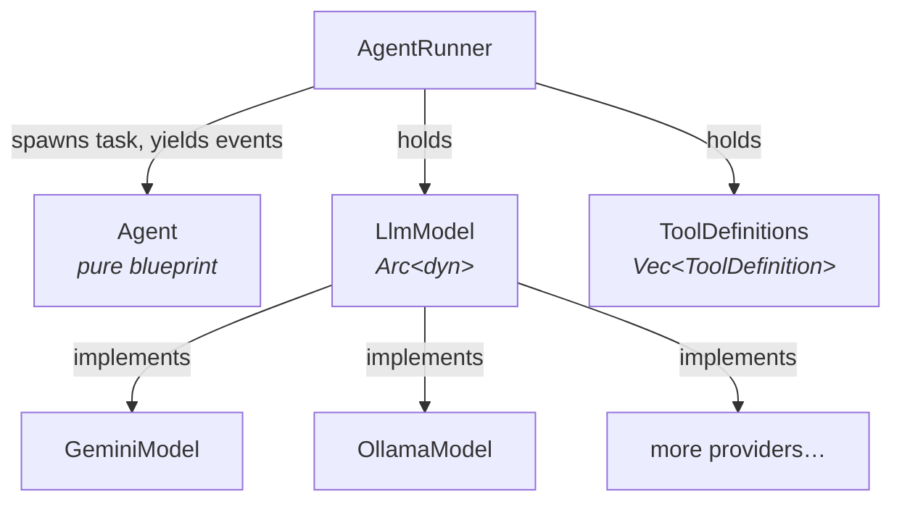

# agent-rig

A provider-agnostic toolkit for building AI agents in Rust.

Define your agent once and run it against any supported LLM backend — swap providers by changing a single constructor call, with no changes to agent logic.

## Features

- **Provider-agnostic API** — same `Agent` + `AgentRunner` code works with Google Gemini, Ollama, or any custom `LlmModel` implementation
- **Streaming agentic loop** — the runner spawns a background task and yields `AgentEvent`s (text deltas, thinking tokens, tool-call lifecycle) until the model produces a final reply
- **Concurrent tool execution** — multiple tool calls in a single model turn are executed in parallel; tool-result messages are paired back to the model in request order
- **Per-tool approval** — override `Tool::requires_approval` to gate individual tool calls (e.g. user approval prompts for destructive actions)
- **Structured output** — constrain model output to a JSON Schema
- **Agent composition** — wrap any agent as a `Tool` with `AgentTool` so a parent agent can delegate to child agents
- **Serializable agents** — `Agent` derives `Serialize`/`Deserialize` for file-based configuration
- **Opt-in providers** — each provider adapter is a Cargo feature; pull in only what you need

## Supported Providers

| Feature   | Provider        | Notes                                        |
|-----------|-----------------|----------------------------------------------|
| `gemini`  | Google Gemini   | Structured output, thinking tokens           |
| `ollama`  | Ollama (local)  | Structured output, native streaming          |

## Installation

Add `agent-rig` to your `Cargo.toml`. Provider adapters are opt-in features — the default feature set is empty.

```toml
# Gemini only
agent-rig = { git = "...", features = ["gemini"] }

# Ollama only
agent-rig = { git = "...", features = ["ollama"] }

# All providers
agent-rig = { git = "...", features = ["full"] }
```

## Quick Start

```rust
use std::sync::Arc;
use agent_rig::Agent;
use agent_rig::model::Message;
use agent_rig::models::gemini::GeminiModel;
use agent_rig::runner::{AgentEvent, AgentRunner};
use futures_util::StreamExt;

#[tokio::main]
async fn main() -> Result<(), Box<dyn std::error::Error>> {
    let model = GeminiModel::builder("YOUR_API_KEY", "gemini-3.1-flash-lite")
        .temperature(0.8)
        .build();

    let agent = Agent::builder()
        .name("Assistant")
        .instructions("You are a helpful assistant.")
        .build();

    let runner = AgentRunner::new(Arc::new(model));

    let mut stream = runner.run(&agent, vec![Arc::new(Message::user("Hello!"))]);
    while let Some(event) = stream.next().await {
        if let AgentEvent::TextDelta(chunk) = event.agent_event {
            print!("{chunk}");
        }
    }
    println!();
    Ok(())
}
```

Set your API key via environment variable (a `.env` file is supported via `dotenvy`):

```bash
GEMINI_API_KEY=your_key cargo run --features gemini
```

## Usage

### The stream API

`AgentRunner::run` takes the agent by reference and the conversation thread by value, and returns an async stream of `RunEvent`s. A `RunEvent` wraps an [`AgentEvent`] with a `run_id` unique to the run that produced it. For a flat single-run consumer the extra fields can be ignored — read `event.agent_event`. The stream ends when the model produces a turn with no tool calls (or on an `AgentEvent::Error`/`AgentEvent::Cancelled`).

```rust
pub struct RunEvent {
    pub run_id: usize,
    pub agent_event: AgentEvent,
}

pub enum AgentEvent {
    /// A request from the runner to execute a tool call.
    ToolCall(ToolCallRequest),
    /// A chunk of the model's reasoning/thinking output.
    ThinkingDelta(String),
    /// A chunk of the model's text output.
    TextDelta(String),
    /// Token counts reported by the provider for one model call.
    Usage(TokenUsage),
    /// Emitted at the start of every run, before any model output.
    TurnStart,
    /// Emitted at the end of a normal completion, carrying the updated thread.
    TurnFinish { thread: Vec<Arc<Message>> },
    /// Emitted if the run is cancelled.
    Cancelled,
    /// Emitted if the provider returns an error.
    Error(Error),
}
```

Concatenating every `TextDelta` reconstructs the final reply. `Usage` fires at most once per model call — a run that issues several tool-calling turns yields one `Usage` event per turn; sum across them for a per-run total.

### Single-turn

```rust
let mut text = String::new();
let mut stream = runner.run(&agent, vec![Arc::new(Message::user("What is the capital of France?"))]);
while let Some(event) = stream.next().await {
    if let AgentEvent::TextDelta(chunk) = event.agent_event {
        text.push_str(&chunk);
    }
}
println!("{text}"); // "Paris"
```

### Multi-turn conversations

`AgentRunner::run` is stateless: each call takes the full thread of reference-counted `Message`s (`Vec<Arc<Message>>`). The caller is responsible for appending the user's input and the assistant's reply between turns.

```rust
use std::sync::Arc;
use agent_rig::model::Message;

let mut thread: Vec<Arc<Message>> = Vec::new();

// Turn 1
thread.push(Arc::new(Message::user("My name is Alice.")));
let mut reply = String::new();
let mut stream = runner.run(&agent, thread.clone());
while let Some(event) = stream.next().await {
    if let AgentEvent::TextDelta(chunk) = event.agent_event { reply.push_str(&chunk); }
}
thread.push(Arc::new(Message::assistant(reply)));

// Turn 2 — the runner sees the full history
thread.push(Arc::new(Message::user("What is my name?")));
let mut stream = runner.run(&agent, thread.clone());
// drive the stream and append the assistant reply again
```

For a complete REPL, see [`examples/multi_turn.rs`](examples/multi_turn.rs).

### Tool calling

Under the **client-resolved tool execution model**, the runner does not execute tools internally. Instead, when the model requests a tool call, the runner yields an `AgentEvent::ToolCall(call)` event. The consumer is responsible for looking up the tool in their registry, executing it, and resolving the call. This completely decouples the runner from tool side effects and enables flexible authorization, caching, or custom execution patterns.

To give your agent callable functions, implement the `Tool` trait:

```rust
use std::sync::Arc;
use async_trait::async_trait;
use agent_rig::tools::{Tool, ToolDefinition, ToolRegistry, ToolResult};
use agent_rig::runner::AgentRunner;
use serde_json::{json, Value};

struct GetWeatherTool {
    definition: ToolDefinition,
}

impl Default for GetWeatherTool {
    fn default() -> Self {
        Self {
            definition: ToolDefinition {
                name: "get_weather".to_string(),
                description: "Returns the current temperature for a city.".to_string(),
                parameters: json!({
                    "type": "object",
                    "properties": { "city": { "type": "string" } },
                    "required": ["city"]
                }),
            },
        }
    }
}

#[async_trait]
impl Tool for GetWeatherTool {
    fn definition(&self) -> &ToolDefinition {
        &self.definition
    }

    // A call runs in two phases: `propose` resolves the args (the default
    // passthrough is fine here), then `apply` executes the approved proposal.
    async fn apply(
        &self,
        proposal: Value,
        _cancel: tokio_util::sync::CancellationToken,
    ) -> ToolResult {
        let city = proposal["city"].as_str().unwrap_or("unknown");
        ToolResult::ok(json!({ "city": city, "celsius": 22.0 }))
    }
}

let registry = ToolRegistry::new().register(GetWeatherTool::default();

let agent = Agent::builder()
    .name("Weather Bot")
    .instructions("Answer weather questions using the available tools.")
    .tool("get_weather")
    .build();

// Construct the runner with the tool definitions so the model knows they exist
let runner = AgentRunner::with_tools(Arc::new(model), registry.definitions());
```

In your event loop, intercept `AgentEvent::ToolCall`, execute the tool from your registry, and resolve the call by calling `call.resolve(result)`. The runner blocks until you resolve the call:

```rust
use agent_rig::runner::AgentEvent;

while let Some(event) = stream.next().await {
    match event.agent_event {
        AgentEvent::ToolCall(tool_call) => {
            println!("[start] {}({})", tool_call.details.name, tool_call.details.args);
            
            // 1. Look up the tool
            let Some(tool) = registry.get(&tool_call.details.name) else {
                tool_call.resolve(ToolResult::error("Unknown tool"));
                continue;
            };
            
            // 2. Execute it
            let result = tool.apply(
                tool_call.details.args.clone(),
                tool_call.cancellation_token.clone()
            ).await;
            
            println!("[done]  {} → {result}", tool_call.details.name);
            
            // 3. Resolve the call to resume the runner
            tool_call.resolve(result);
        }
        AgentEvent::TextDelta(chunk) => print!("{chunk}"),
        AgentEvent::ThinkingDelta(_) => {}
        AgentEvent::Usage(usage) => println!("[usage] {usage:?}"),
        AgentEvent::Error(e) => eprintln!("[runner error] {e}"),
        _ => {}
    }
}
```

### Authorization

Because tool execution is resolved by the client, gating tool calls behind user approval is highly straightforward. You can orchestrate a two-phase execution flow (`Tool::propose` followed by `Tool::apply`) directly in your event loop:

1. **Propose**: Call `tool.propose(...)` to resolve the raw arguments into a *proposal* — a side-effect-free description of what will happen (e.g., an edit tool reading the file and returning a diff).
2. **Prompt**: Show this proposal/diff to the user and prompt for confirmation.
3. **Apply**: If approved, call `tool.apply(...)` with the proposal and resolve the call. If denied, resolve the call with a soft error.

```rust
use std::sync::Arc;
use agent_rig::tools::{Tool, ToolDefinition, ToolResult};
use serde_json::Value;

struct SendEmailTool { /* ... */ }

impl Tool for SendEmailTool {
    fn definition(&self) -> &ToolDefinition { /* ... */ }

    fn requires_approval(&self, _args: &Value) -> bool {
        true  // indicate to the client that this tool requires approval
    }

    async fn propose(
        &self,
        tool_call: Arc<crate::model::ToolCall>,
        _cancel: tokio_util::sync::CancellationToken,
    ) -> ToolResult {
        // Resolve raw args to a descriptive proposal (e.g., envelope details + body preview)
        ToolResult::ok(json!({
            "to": tool_call.args["to"],
            "preview": format!("Subject: {}\n\n{}", tool_call.args["subject"], tool_call.args["body"])
        }))
    }

    async fn apply(
        &self,
        proposal: Value,
        _cancel: tokio_util::sync::CancellationToken,
    ) -> ToolResult {
        // executes only after approval
        ToolResult::ok(json!({ "status": "sent" }))
    }
}
```

In your event loop, orchestrate the approval logic like this:

```rust
AgentEvent::ToolCall(tool_call) => {
    let Some(tool) = registry.get(&tool_call.details.name) else {
        tool_call.resolve(ToolResult::error("Unknown tool"));
        continue;
    };

    // 1. Generate the proposal
    let proposal = tool.propose(
        tool_call.details.clone(),
        tool_call.cancellation_token.clone()
    ).await;

    let ToolResult::Ok(proposal_val) = proposal else {
        tool_call.resolve(proposal); // propose failed, resolve immediately
        continue;
    };

    // 2. Check if approval is needed and prompt the user
    let approved = if tool.requires_approval(&tool_call.details.args) {
        let preview = proposal_val["preview"].as_str().unwrap_or("");
        prompt_user_for_email_send(preview) // your custom UI prompt logic
    } else {
        true
    };

    if !approved {
        tool_call.resolve(ToolResult::error("User rejected approval"));
        continue;
    }

    // 3. Apply the approved proposal
    let result = tool.apply(proposal_val, tool_call.cancellation_token.clone()).await;
    tool_call.resolve(result);
}
```

For a fully working CLI prompt implementation, see [`examples/mpsc_auth_flow.rs`](examples/mpsc_auth_flow.rs).

### Structured output

Use `output_schema` to constrain the model to a JSON Schema. The [`schemars`](https://crates.io/crates/schemars) crate can generate the schema from a Rust struct. Accumulate the streamed text and deserialize it into your type.

```rust
use schemars::JsonSchema;
use serde::Deserialize;

#[derive(Debug, Deserialize, JsonSchema)]
struct ResearchPlan {
    title: String,
    tasks: Vec<String>,
}

let agent = Agent::builder()
    .name("Planner")
    .instructions("Produce a structured research plan.")
    .output_schema(schemars::schema_for!(ResearchPlan))
    .build();

let mut output = String::new();
let mut stream = runner.run(&agent, vec![Arc::new(Message::user("AI agents"))]);
while let Some(event) = stream.next().await {
    if let AgentEvent::TextDelta(chunk) = event.agent_event { output.push_str(&chunk); }
}
let plan: ResearchPlan = serde_json::from_str(&output)?;
println!("{}", plan.title);
```

### Streaming

Streaming is the only mode — `AgentRunner::run` already returns a stream. `ThinkingDelta` chunks arrive only when the provider supports extended thinking (e.g. Gemini with `include_thoughts: true`).

```rust
use futures_util::StreamExt;
use agent_rig::runner::AgentEvent;

let mut stream = runner.run(&agent, vec![Arc::new(Message::user("Explain Rust ownership."))]);
while let Some(event) = stream.next().await {
    match event.agent_event {
        AgentEvent::ThinkingDelta(token) => print!("\x1b[2m{token}\x1b[0m"),
        AgentEvent::TextDelta(chunk) => print!("{chunk}"),
        AgentEvent::ToolCall(call) => println!("\n[tool call: {}]", call.details.name),
        AgentEvent::Error(e) => eprintln!("\n[error] {e}"),
        _ => {}
    }
}
```

Each `RunEvent` carries a `run_id` (unique per run) so you can identify which execution produced a given event. For nested child agent executions, the child run is driven and fully encapsulated internally by `AgentTool` (yielding a single flat tool response back to the parent runner), ensuring that child events do not pollute the parent's event stream. For an example of agent composition, see [`examples/agent_as_tool.rs`](examples/agent_as_tool.rs).

### Agent composition

Wrap an `AgentRunner` + `Agent` pair as an `AgentTool` and register it with a parent runner via the standard `ToolRegistry::register` method. The parent model invokes the child agent as if it were a regular tool. The child's run is driven and fully encapsulated internally within `AgentTool::apply`, yielding a single flat text response back to the parent model.

```rust
use std::sync::Arc;
use agent_rig::Agent;
use agent_rig::runner::AgentRunner;
use agent_rig::tools::{AgentTool, ToolDefinition, ToolRegistry};
use serde_json::json;

// Child agent
let child_model = GeminiModel::builder(&api_key, MODEL).build();
let child_agent = Agent::builder()
    .name("Summariser")
    .instructions("Summarise the text in the `text` field of your JSON input.")
    .build();
let child_runner = AgentRunner::new(Arc::new(child_model));

let summarise_tool = AgentTool::new(
    ToolDefinition {
        name: "summarise".to_string(),
        description: "Summarises a long piece of text into two sentences.".to_string(),
        parameters: json!({
            "type": "object",
            "properties": { "text": { "type": "string" } },
            "required": ["text"]
        }),
    },
    child_agent,
    child_runner,
);

// Parent runner setup
let registry = ToolRegistry::new().register(summarise_tool);
let parent_runner = AgentRunner::with_tools(Arc::new(parent_model), registry.definitions());

let parent_agent = Agent::builder()
    .name("Orchestrator")
    .instructions("Use the `summarise` tool when asked to summarise text.")
    .tool("summarise")
    .build();
```

## Provider Configuration

### Google Gemini

Requires a `GEMINI_API_KEY` environment variable.

```rust
use agent_rig::models::gemini::GeminiModel;
use geologia::prelude::{ThinkingConfig, ThinkingLevel};

let model = GeminiModel::builder("API_KEY", "gemini-3.1-flash-lite")
    .temperature(0.7)
    .max_output_tokens(2048)
    .top_p(0.9)
    .thinking_config(ThinkingConfig {
        include_thoughts: true,
        thinking_level: Some(ThinkingLevel::High),
        ..Default::default()
    })
    .build();
```

### Ollama

Requires a running [Ollama](https://ollama.ai) server.

```rust
use agent_rig::models::ollama::OllamaModel;

let model = OllamaModel::builder("http://localhost:11434", "llama3.2")
    .temperature(0.8)
    .num_ctx(4096)
    .build();
```

## Architecture



`Agent` is a pure data blueprint with no model reference — it holds the name, instructions, optional output schema, and the list of tool names the agent may use. `AgentRunner` owns an `Arc<dyn LlmModel>` and a list of tool definitions. The runner is cheap to `Clone` (internals are `Arc`) so a single runner can be shared across tasks.

### Core Types

| Type | Description |
|------|-------------|
| `Agent` / `AgentBuilder` | Serializable agent blueprint (name, instructions, allowed tools, output schema) |
| `AgentRunner` | Execution engine; owns the model and the list of allowed tool definitions |
| `LlmModel` | Async trait that provider adapters implement (`generate`, `generate_stream`) |
| `Message` / `MessageContent` | Conversation history elements. `MessageContent` is either `Text`, `ToolCalls(Vec<Arc<ToolCall>>)`, or `ToolResult` |
| `Tool` / `ToolDefinition` | Async trait for callable tools; declares name, description, and parameter JSON Schema |
| `ToolRegistry` | Client-side registry of `Tool` and `AgentTool` implementations, used to resolve tool calls |
| `AgentTool` | Wraps an `AgentRunner` + `Agent` as a standard `Tool` for nesting and composition |
| `AgentEvent` | Stream event: `TurnStart`, `ThinkingDelta`, `TextDelta`, `ToolCall`, `Usage`, `TurnFinish`, `Cancelled`, `Error` |
| `RunEvent` | An `AgentEvent` tagged with the unique `run_id` of the run that produced it |
| `ToolCallResult` | Auxiliary outcome status of a tool call: `Ok(Value)`, `Err(Error)`, `Denied`, `Unknown` |
| `Error` | `Provider(String)` or `Agent(String)` |

### Custom providers

Implement `LlmModel` to add any provider. The default `generate_stream` calls `generate` and wraps the response as a single batch of chunks, so adapters only need to implement `generate`. Override `generate_stream` for true token-by-token streaming.

```rust
use async_trait::async_trait;
use agent_rig::model::{LlmModel, ModelRequest, ModelResponse};
use agent_rig::error::Error;

struct MyModel;

#[async_trait]
impl LlmModel for MyModel {
    async fn generate(&self, request: ModelRequest) -> Result<ModelResponse, Error> {
        // Translate ModelRequest → your provider's API call
        // Return ModelResponse { text, tool_calls, thinking, token_usage }
        todo!()
    }
}
```

Pass it to the runner: `AgentRunner::new(Arc::new(MyModel))`.

## Running Examples

All Gemini examples require `GEMINI_API_KEY`. Ollama examples require a running Ollama server.

```bash
# Simple single-turn agent
GEMINI_API_KEY=your_key cargo run --example simple_agent --features gemini

# Tool calling
GEMINI_API_KEY=your_key cargo run --example tool_calling --features gemini

# Structured output
GEMINI_API_KEY=your_key cargo run --example structured_output --features gemini

# Streaming with thinking tokens
GEMINI_API_KEY=your_key cargo run --example streaming_agent --features gemini

# Multi-turn REPL
GEMINI_API_KEY=your_key cargo run --example multi_turn --features gemini

# Agent as a tool (composition)
GEMINI_API_KEY=your_key cargo run --example agent_as_tool --features gemini

# Authorization prompt before a destructive tool
GEMINI_API_KEY=your_key cargo run --example mpsc_auth_flow --features gemini

# Parallel tool calls
GEMINI_API_KEY=your_key cargo run --example parallel_tool_calls --features gemini

# Long-term memory via tools
GEMINI_API_KEY=your_key cargo run --example long_term_memory --features gemini
```

## Testing

```bash
# Unit tests (no network)
cargo test

# Gemini integration tests (requires GEMINI_API_KEY)
GEMINI_API_KEY=your_key cargo test --test integration_gemini --features gemini

# Ollama integration tests (requires running Ollama server)
cargo test --test integration_ollama --features ollama
```

## Building

```bash
cargo build                        # default (no providers compiled)
cargo build --features gemini      # with Gemini
cargo build --features full        # all providers
cargo build --release --features full
```

## License

See [LICENSE](LICENSE).
